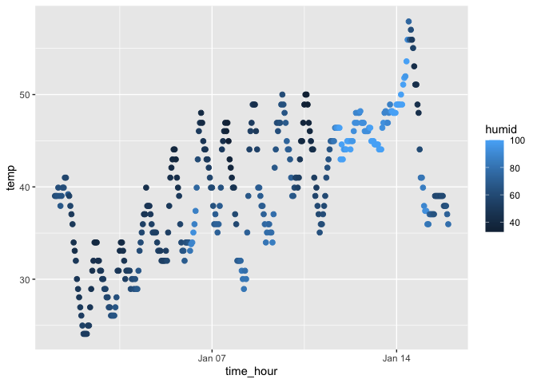

p8105_hw1_yj2803
================
Yuki Joyama
2023-09-23

# Problem 1

The dataset “early_january_weather” contains the following variables:  
day, dewp, hour, humid, month, origin, precip, pressure, temp,
time_hour, visib, wind_dir, wind_gust, wind_speed, year  
It has 358 rows and 15 columns.  
The mean temperature (temp) in this dataset is 39.58°F.

## The relationship among temperature, time in hour, and humidity

<!-- -->

The scatterplot shows that temperatures fluctuate within a day and tend
to increase toward mid-January. Humidity seems to tend to decrease as
temperatures increase and increase as temperatures go down. However, a
few days of generally high humidity were observed at the end of the
second week of January.

# Problem 2

## Creating a dataframe

``` r
df <- tibble(
  norm_samp = rnorm(10), # create a random sample of size 10 from a standard normal distribution
  norm_samp_log = norm_samp > 0, # a logical vector indicating if elements in df are greater then 0
  norm_samp_char = c("Potato", "Onion", "Carrot", "Beef", "Tofu", "Shiitake", "Soysauce", "Salt", "Scallion", "Bokchoy"), # a character vector of length 10
  norm_samp_factor = c("Vegetable", "Vegetable", "Vegetable", "Protein", "Protein", "Vegetable", "Seasoning", "Seasoning", "Vegetable", "Vegetable") %>%
  factor() # a factor vector of length 10, with 3 different factor levels
)
df
```

    ## # A tibble: 10 × 4
    ##    norm_samp norm_samp_log norm_samp_char norm_samp_factor
    ##        <dbl> <lgl>         <chr>          <fct>           
    ##  1    -0.136 FALSE         Potato         Vegetable       
    ##  2     1.28  TRUE          Onion          Vegetable       
    ##  3    -1.99  FALSE         Carrot         Vegetable       
    ##  4    -0.606 FALSE         Beef           Protein         
    ##  5     0.457 TRUE          Tofu           Protein         
    ##  6    -0.250 FALSE         Shiitake       Vegetable       
    ##  7    -0.875 FALSE         Soysauce       Seasoning       
    ##  8     0.742 TRUE          Salt           Seasoning       
    ##  9    -0.626 FALSE         Scallion       Vegetable       
    ## 10     0.293 TRUE          Bokchoy        Vegetable

## Mean of each variable

Now, we take the mean of each variable in the above dataframe.

``` r
mean_samp <- mean(pull(df, norm_samp)) %>% 
  print() # mean of a norm_samp in df
```

    ## [1] -0.1707833

``` r
mean_log <- mean(pull(df, norm_samp_log)) %>% 
  print() # mean of a norm_samp_log in df
```

    ## [1] 0.4

``` r
mean_char <- mean(pull(df, norm_samp_char)) %>% 
  print() # mean of a norm_samp_char in df
```

    ## Warning in mean.default(pull(df, norm_samp_char)): argument is not numeric or
    ## logical: returning NA

    ## [1] NA

``` r
mean_factor <- mean(pull(df, norm_samp_factor)) %>% 
  print() # mean of a norm_samp_factor in df
```

    ## Warning in mean.default(pull(df, norm_samp_factor)): argument is not numeric or
    ## logical: returning NA

    ## [1] NA

As shown in the outputs, norm_samp and norm_samp_log returned valid
means, while norm_samp_char and norm_samp_factor returned errors.

## Converting variables into numeric

``` r
as.numeric(df$norm_samp_log) # logical -> numeric
as.numeric(df$norm_samp_char) # character -> numeric
as.numeric(df$norm_samp_factor) # factor -> numeric
```

When the as.numeric function was applied to the dataframe, the logical
and factor vectors were successfully replaced by numeric values. No
change was observed in the character vector. This is because the
as.numeric function converts TRUE to 1 and FALSE to 0 for the logical
vector, and returns the numeric code corresponding to the factor level
for the factor vector. Numeric values cannot be assigned to a character
vector unless it consists of a numeric value in character form (e.g.,
“1”, “2”, etc.).

Since there are two variables in the logical vector that can be
converted to binary numbers, the mean function can return values in the
proportion of TRUE (1). The mean function could not be applied for the
character and factor vector in the dataframe because it is not numeric
or logical. Only after successfully converting them to numeric values
can the mean function be expected to return a valid value.
